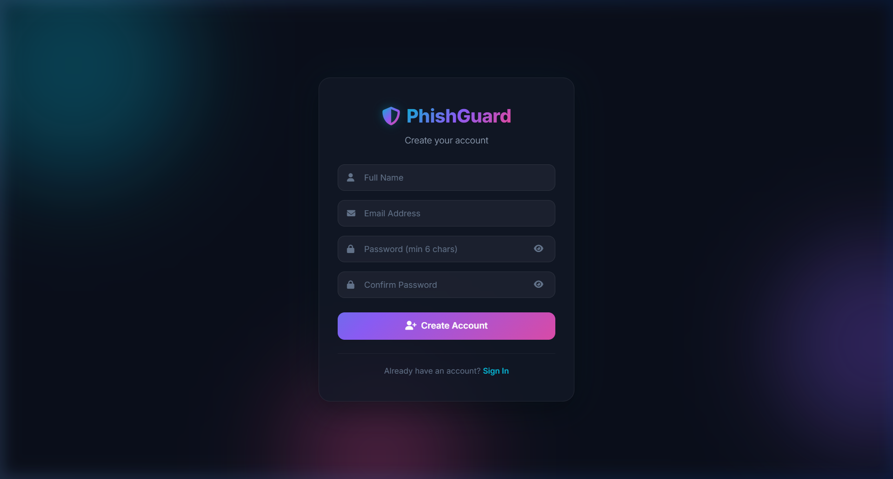
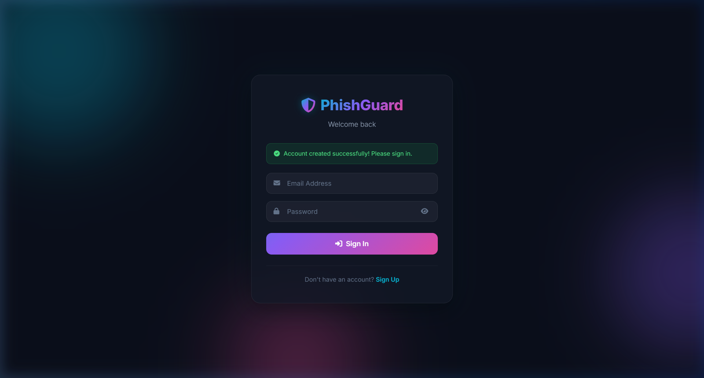
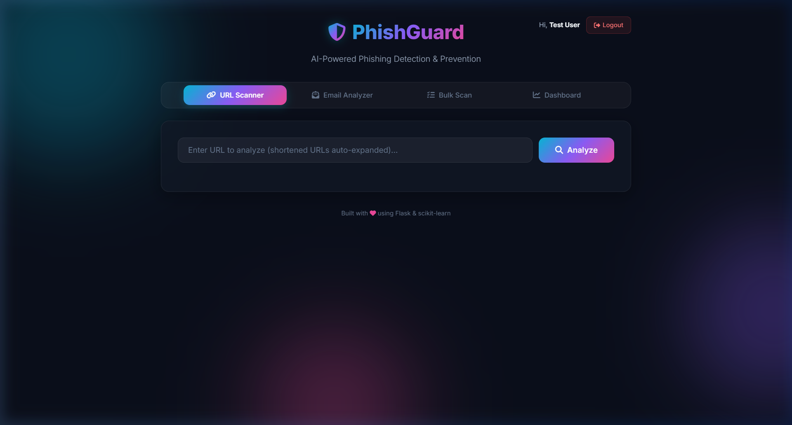
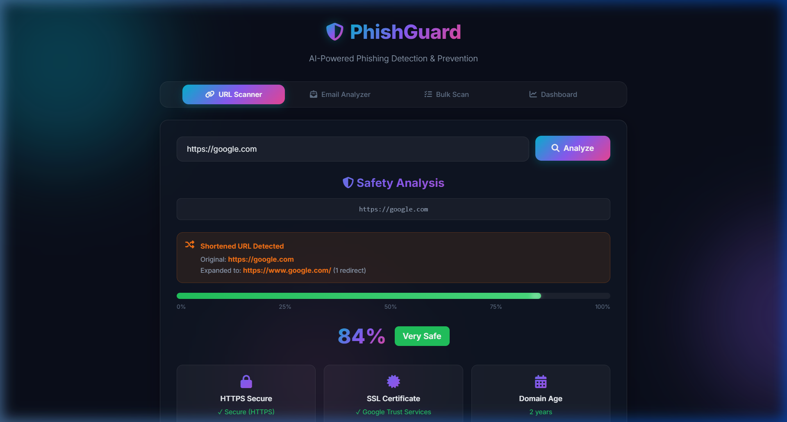
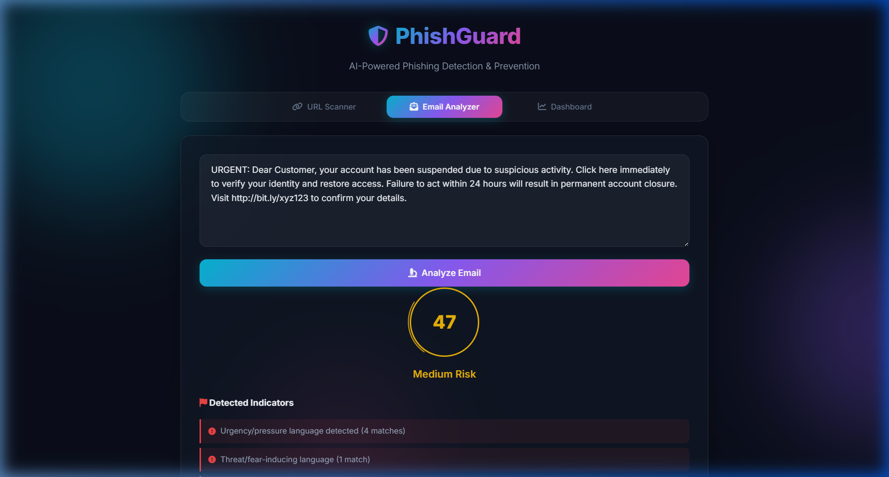
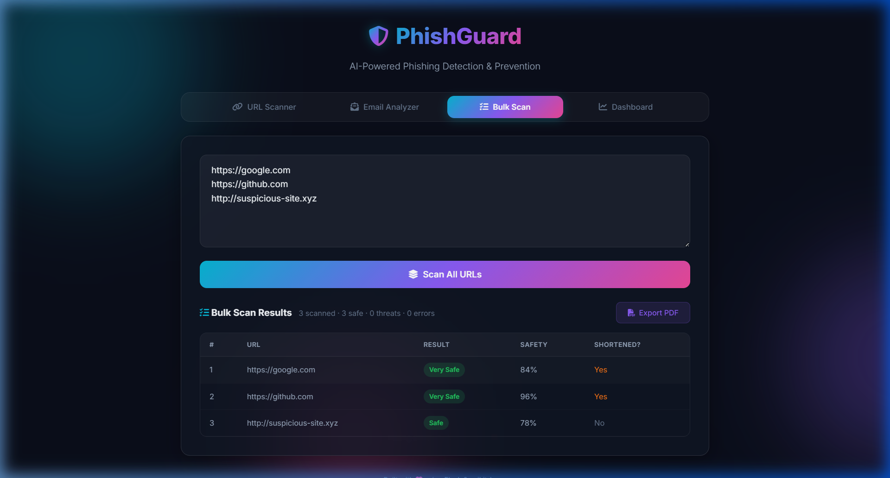
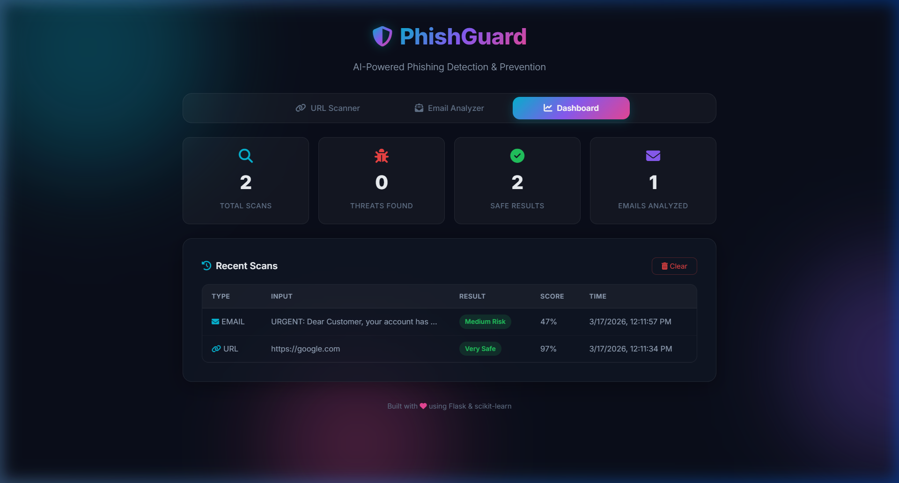
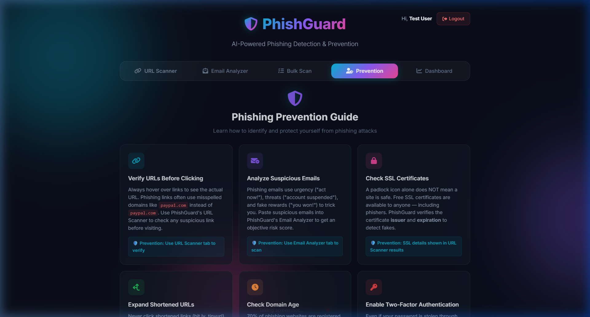
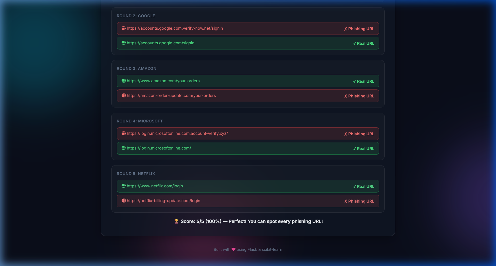

# 🛡️ PhishGuard — AI-Powered Phishing Detection & Prevention

[](https://python.org)
[](https://flask.palletsprojects.com)
[](https://scikit-learn.org)
[](LICENSE)

**PhishGuard** is a full-stack AI-powered web application that detects phishing URLs and suspicious emails in real-time. Built with Flask and scikit-learn, it features SSL certificate verification, URL shortener expansion, bulk scanning, PDF report export, user authentication, and a premium dark-themed UI with glassmorphism design.

---

## 📑 Table of Contents

1. [Demo Screenshots](#-demo-screenshots)
2. [Abstract](#1-abstract)
3. [Real-World Problems Solved](#-real-world-problems-solved)
4. [Introduction](#2-introduction)
5. [Features Overview](#3-features-overview)
6. [Technology Stack](#4-technology-stack)
7. [System Architecture](#5-system-architecture)
8. [Project Structure](#6-project-structure)
9. [Installation & Setup](#7-installation--setup)
10. [Module-Wise Walkthrough](#8-module-wise-walkthrough)
10. [Machine Learning Model](#9-machine-learning-model)
11. [Feature Extraction Pipeline](#10-feature-extraction-pipeline)
12. [Security Analysis Techniques](#11-security-analysis-techniques)
13. [API Endpoints](#12-api-endpoints)
14. [Prevention Strategies](#13-prevention-strategies)
15. [Results & Performance](#14-results--performance)
16. [Future Roadmap](#15-future-roadmap)
17. [References](#16-references)

---

## 🎬 Demo Screenshots

### 🔐 Sign Up Page
Create an account with name, email, and password (with show/hide toggle).



### 🔑 Sign In Page
Secure login with flash messages for success and error feedback.



### 🏠 Main Application — URL Scanner
After login, the user sees a personalized greeting ("Hi, **Test User**") with a logout button. The URL Scanner tab is the default view.



### 🔗 URL Scanner — SSL Certificate & Redirect Detection
Analyzing `https://google.com` — shows 84% Very Safe with SSL Certificate by **Google Trust Services**, redirect detection, domain age, cert expiry, and URL length.



### 📧 Email Analyzer — Phishing Pattern Detection
Analyzing a phishing email — detects urgency language (4 matches), threat language (1 match), and embedded URLs. Risk score: **47% Medium Risk**.



### 📋 Bulk URL Scanner — Batch Analysis
Scanning 3 URLs simultaneously — google.com (84%), github.com (96%), suspicious-site.xyz (78%). Shows safety badges and shortened URL detection.



### 📊 Dashboard — Scan History & Statistics
Stats cards (Total Scans, Threats Found, Safe Results, Emails Analyzed) with a recent scans table showing type, input, result badges, scores, and timestamps.



### 🛡️ Prevention Guide — Interactive Tips
10 phishing prevention tips with actionable advice. Each card links back to PhishGuard's detection tools.



### 🎓 Phishing Quiz — Can You Spot the Fake?
5-round interactive quiz with real vs fake URLs (PayPal, Google, Amazon, Microsoft, Netflix). Green = ✓ Real, Red = ✗ Phishing.



---

## 1. Abstract

Phishing remains one of the most prevalent cyber threats, with attackers impersonating legitimate entities through fake websites and deceptive emails to steal sensitive data. This project presents **PhishGuard**, an intelligent phishing detection and prevention system that combines **machine learning** (Random Forest Classifier), **natural language processing** (keyword pattern matching), **SSL certificate analysis**, and **URL redirect tracing** into a single, user-friendly web application.

The system analyzes URLs by extracting 15 structural features and passing them through a trained ML model to predict phishing probability. It also performs real-time WHOIS lookups for domain age, verifies SSL certificates, expands shortened URLs, and scans email content for phishing indicators across 7 threat categories. Results are presented through an interactive dark-themed dashboard with exportable PDF reports.

---

## 🌍 Real-World Problems Solved

PhishGuard directly addresses the following **real-world cybersecurity challenges** that individuals, businesses, and organizations face every day:

### 🎣 Problem 1: Phishing URLs are Nearly Indistinguishable from Legitimate Ones
**Real-world scenario:** An employee receives a link `https://paypa1-security.com/verify` that looks like PayPal but is a phishing site. Traditional blacklists don't flag it because it's a newly registered domain.

**How PhishGuard solves it:** The ML model analyzes 15 structural features of the URL — detecting suspicious character patterns (the `1` replacing `l`), unusual domain length, and the new domain age via WHOIS — to flag it as risky, even without it being on any blacklist.

---

### 📧 Problem 2: Phishing Emails Manipulate Emotions to Bypass Human Judgment
**Real-world scenario:** A user receives an email saying *"Your bank account has been compromised. Click here IMMEDIATELY or your funds will be frozen within 24 hours."* The urgency causes panic and the user almost clicks.

**How PhishGuard solves it:** The Email Analyzer scans for **urgency language**, **threat keywords**, **credential requests**, and **embedded URLs** across 7 categories, giving an objective risk score instead of relying on human judgment under pressure.

---

### 🔗 Problem 3: Shortened URLs Hide Malicious Destinations
**Real-world scenario:** A social media post shares `bit.ly/free-gift-2026` — but behind the shortener is a phishing page at `http://stealing-data.ru/login.php`.

**How PhishGuard solves it:** The URL Shortener Expander automatically follows all redirects and reveals the **final destination URL** before analyzing it. Users can see exactly where a shortened link leads without ever visiting it.

---

### 🔐 Problem 4: Fake Websites Use Invalid or Self-Signed SSL Certificates
**Real-world scenario:** A phishing site mimicking a banking portal has a self-signed SSL certificate. The browser shows a padlock icon, giving users false confidence.

**How PhishGuard solves it:** The SSL Certificate Checker verifies the **certificate issuer** (e.g., Google Trust Services, Let's Encrypt), **expiration date**, and **validity**. Self-signed or expired certificates are instantly flagged.

---

### 🆕 Problem 5: Newly Registered Domains Are Used for Phishing Campaigns
**Real-world scenario:** Attackers register `amazon-deals-today.com` just 3 days before launching a phishing campaign. Blacklists haven't caught it yet.

**How PhishGuard solves it:** Real-time **WHOIS domain age lookups** check when a domain was registered. Domains less than 30 days old are flagged as high-risk — catching zero-day phishing sites that blacklists miss.

---

### 🏢 Problem 6: Organizations Need to Audit Multiple URLs at Scale
**Real-world scenario:** A company's IT security team receives a list of 15 suspicious URLs reported by employees and needs to assess all of them quickly.

**How PhishGuard solves it:** The **Bulk URL Scanner** processes up to 20 URLs simultaneously, providing a summary table with safety scores, threat indicators, and shortened URL detection — reducing what would take hours to a few seconds.

---

### 📄 Problem 7: Security Incidents Require Documentation for Compliance
**Real-world scenario:** After detecting a phishing attempt, the security team needs to produce an incident report documenting the threat for regulatory compliance (GDPR, SOC 2, etc.).

**How PhishGuard solves it:** The **PDF Report Export** generates professional, timestamped reports for URL scans, email analyses, and bulk scans — ready for incident documentation, legal proceedings, or audit trails.

---

### 👤 Problem 8: Shared Tools Need User Accountability
**Real-world scenario:** In an office environment, multiple team members use the same phishing detection tool, but there's no way to track who scanned what.

**How PhishGuard solves it:** The **User Authentication system** (signup/signin) ensures each user has their own session, with personalized greetings and individual scan histories.

---

### 🎁 Problem 9: Lottery/Reward Scam Emails Target Vulnerable Users
**Real-world scenario:** An elderly person receives an email: *"Congratulations! You've won a $50,000 prize. Click here to claim your reward."* They're tempted to click.

**How PhishGuard solves it:** The Email Analyzer detects **reward bait patterns** (weighted at 14/100 — the second highest weight) and flags the email as high risk, providing clear recommendations to not interact with it.

---

### 📉 Problem 10: Traditional Detection Methods Are Reactive, Not Proactive
**Real-world scenario:** Blacklist-based tools can only flag URLs that have **already been reported**. A brand-new phishing URL created 5 minutes ago won't appear on any blacklist.

**How PhishGuard solves it:** Machine learning-based detection is **proactive** — it analyses the structure and characteristics of a URL to predict phishing probability, even for URLs that have never been seen before. Combined with real-time SSL and WHOIS checks, PhishGuard detects threats that blacklists can't.

---

## 2. Introduction

### 2.1 Purpose

This project aims to develop a comprehensive, real-time phishing detection system that goes beyond basic URL blacklisting. By combining multiple detection techniques — machine learning, heuristic analysis, SSL verification, and email content scanning — PhishGuard provides layered security assessment suitable for both individual users and organizations.

### 2.2 Background

Phishing attacks cost organizations billions of dollars annually. Traditional detection methods relying on blacklists are reactive and cannot catch zero-day phishing sites. Machine learning approaches trained on URL structural features can detect previously unseen phishing URLs by identifying patterns common to malicious sites — such as excessive special characters, suspicious domain lengths, absence of HTTPS, and newly registered domains.

### 2.3 Problem Statement

Users and organizations need a tool that can:
- Analyze URLs in real-time before visiting them
- Detect phishing patterns in suspicious emails
- Verify SSL certificate authenticity
- Expand and analyze shortened URLs (commonly used by attackers)
- Scan multiple URLs in bulk for organizational security audits
- Generate downloadable reports for incident documentation

### 2.4 Scope

PhishGuard addresses all of the above through a web-based interface built with Flask (backend) and vanilla HTML/CSS/JavaScript (frontend), with a pre-trained Random Forest model for URL classification and NLP-based email analysis.

### 2.5 Definitions & Acronyms

| Term | Definition |
|---|---|
| **URL** | Uniform Resource Locator |
| **ML** | Machine Learning |
| **NLP** | Natural Language Processing |
| **HTTPS** | Hypertext Transfer Protocol Secure |
| **SSL** | Secure Sockets Layer |
| **WHOIS** | Protocol for querying domain registration data |
| **RF** | Random Forest (ensemble learning algorithm) |
| **API** | Application Programming Interface |

---

## 3. Features Overview

| # | Feature | Description |
|---|---|---|
| 1 | 🔐 **User Authentication** | Signup/Signin with password hashing and session management |
| 2 | 🔗 **URL Scanner** | ML-powered phishing detection with 15 URL features |
| 3 | 📧 **Email Analyzer** | NLP-based phishing pattern detection across 7 threat categories |
| 4 | 📋 **Bulk URL Scanner** | Scan up to 20 URLs simultaneously |
| 5 | 🔐 **SSL Certificate Checker** | Verify certificate issuer, expiry, and validity |
| 6 | 🔗 **URL Shortener Expander** | Auto-expand bit.ly, tinyurl, etc. and trace redirect chains |
| 7 | 🌐 **WHOIS Domain Age** | Real-time domain registration age lookup |
| 8 | 📊 **Interactive Dashboard** | Stats cards, scan history, and threat tracking |
| 9 | 📄 **PDF Report Export** | Download analysis reports for URL, email, and bulk scans |
| 10 | 🛡️ **Prevention Guide** | 10 interactive prevention tips with actionable advice |
| 11 | 🎓 **Phishing Quiz** | 5-round interactive real vs fake URL identification quiz |
| 12 | 🎨 **Premium Dark UI** | Glassmorphism, animated gradient orbs, and micro-interactions |
| 13 | 📱 **Responsive Design** | Works on desktop, tablet, and mobile devices |

---

## 4. Technology Stack

### Backend
| Technology | Purpose |
|---|---|
| **Python 3.8+** | Core programming language |
| **Flask 2.0** | Web framework for REST API and template rendering |
| **Flask-CORS** | Cross-origin resource sharing |
| **scikit-learn** | Machine learning (Random Forest Classifier) |
| **pandas** | Data manipulation and feature engineering |
| **python-whois** | WHOIS domain age lookups |
| **Werkzeug Security** | Password hashing (PBKDF2) for authentication |
| **ssl / socket** | SSL certificate verification (Python standard library) |
| **requests** | HTTP requests for URL expansion |
| **pickle** | Model serialization |
| **gunicorn** | Production WSGI server |

### Frontend
| Technology | Purpose |
|---|---|
| **HTML5** | Semantic page structure |
| **CSS3** | Dark theme, glassmorphism, animations |
| **Vanilla JavaScript** | Tab navigation, API calls, dynamic rendering |
| **jsPDF** | Client-side PDF report generation |
| **Font Awesome 6** | Icon library |
| **Google Fonts (Inter)** | Modern typography |

---

## 5. System Architecture

```
┌─────────────────────────────────────────────────────────────────┐
│                        USER (Browser)                           │
│                                                                 │
│  ┌──────────┐  ┌──────────┐  ┌──────────┐  ┌───────────────┐  │
│  │  Signup  │  │  Signin  │  │  Logout  │  │ Main App (4   │  │
│  │  Page    │  │  Page    │  │          │  │ tab panels)   │  │
│  └────┬─────┘  └────┬─────┘  └────┬─────┘  └───────┬───────┘  │
│       │              │             │                │           │
│       └──────────────┴─────────────┴────────────────┘           │
│                              │                                   │
│                  JavaScript (fetch API) + jsPDF                 │
│                       localStorage (History)                    │
└──────────────────────────────┬──────────────────────────────────┘
                               │ HTTP REST API
┌──────────────────────────────┴──────────────────────────────────┐
│                      FLASK SERVER (Python)                       │
│                                                                 │
│  ┌────────────────────────────────────────────────────────────┐ │
│  │              Authentication Layer                          │ │
│  │  /signup  │  /signin  │  /logout  │  login_required       │ │
│  │  Password Hashing (Werkzeug)  │  Session Management       │ │
│  └────────────────────────────────────────────────────────────┘ │
│                                                                 │
│  ┌──────────────┐  ┌──────────────┐  ┌──────────────────────┐  │
│  │ /check/url   │  │ /check/email │  │ /check/bulk          │  │
│  │              │  │              │  │                      │  │
│  │ ┌──────────┐ │  │ ┌──────────┐ │  │ (batch /check/url    │  │
│  │ │Feature   │ │  │ │NLP       │ │  │  processing)         │  │
│  │ │Extraction│ │  │ │Pattern   │ │  └──────────────────────┘  │
│  │ │(15 feats)│ │  │ │Matching  │ │                            │
│  │ └────┬─────┘ │  │ │(7 cats)  │ │  ┌──────────────────────┐  │
│  │      │       │  │ └──────────┘ │  │ /check/ssl           │  │
│  │ ┌────┴─────┐ │  └──────────────┘  │ (SSL cert check)     │  │
│  │ │ML Model  │ │                    └──────────────────────┘  │
│  │ │(Random   │ │                                              │
│  │ │ Forest)  │ │  ┌──────────────────────────────────────┐    │
│  │ └──────────┘ │  │ WHOIS Lookup │ SSL Check │ URL Expand│    │
│  └──────────────┘  └──────────────────────────────────────┘    │
│                                                                 │
│  ┌────────────────────────────────────────────────────────────┐ │
│  │                   Data Storage                             │ │
│  │  users.json (hashed passwords)  │  phishing.pkl (ML model)│ │
│  └────────────────────────────────────────────────────────────┘ │
└─────────────────────────────────────────────────────────────────┘
```

---

## 6. Project Structure

```
PhishGuard/
│
├── app.py                     # Flask backend — auth, API endpoints, ML logic
├── train_model.py             # Model training script (Random Forest)
├── phishing.pkl               # Pre-trained serialized ML model
├── requirements.txt           # Python dependencies
├── Procfile                   # Deployment config (Render / Railway / Heroku)
├── LICENSE                    # MIT License
├── .gitignore                 # Git ignore rules
├── README.md                  # This documentation file
│
├── templates/                 # Jinja2 HTML templates
│   ├── index.html             # Main app (5-tab layout: URL, Email, Bulk, Prevention, Dashboard)
│   ├── signup.html            # User registration page
│   └── signin.html            # User login page
│
├── static/                    # Frontend assets
│   ├── style.css              # Main stylesheet (dark theme, glassmorphism, prevention)
│   ├── auth.css               # Authentication pages stylesheet
│   └── script.js              # Frontend logic (tabs, API, PDF, dashboard, quiz)
│
├── demos/                     # Screenshot demos for README
│   ├── signup.png             # Sign up page screenshot
│   ├── signin.png             # Sign in page screenshot
│   ├── main_app.png           # Main app with user greeting
│   ├── url_scanner.png        # URL scanner results
│   ├── email_analyzer.png     # Email analyzer results
│   ├── bulk_scanner.png       # Bulk scanner results
│   ├── dashboard.png          # Dashboard with scan history
│   ├── prevention_guide.png   # Prevention tips grid
│   └── phishing_quiz.png      # Interactive phishing quiz results
│
├── phishing.ipynb             # Jupyter notebook for data exploration
└── Report.docx                # Project report document
```

---

## 7. Installation & Setup

### Prerequisites
- Python 3.8 or higher
- pip package manager
- Modern web browser (Chrome, Firefox, Edge)

### Step-by-Step Setup

```bash
# 1. Clone the repository
git clone https://github.com/yourusername/PhishGuard.git
cd PhishGuard

# 2. Install dependencies
pip install -r requirements.txt

# 3. Run the application
python app.py

# 4. Open in browser
# Navigate to http://localhost:5000
# Create an account on the signup page, then sign in to access the app
```

### Dependencies (requirements.txt)

```
Flask==2.0.1
flask-cors
pandas==2.2.2
scikit-learn>=1.4.0
python-whois==0.9.4
requests==2.26.0
gunicorn==21.2.0
Werkzeug==2.0.3
```

---

## 8. Module-Wise Walkthrough

### 8.1 Authentication Module

**Files:** `app.py` (routes), `templates/signup.html`, `templates/signin.html`, `static/auth.css`

**How It Works:**
1. **Signup** — User registers with name, email, and password. Passwords are hashed using `werkzeug.security.generate_password_hash` (PBKDF2 algorithm) before storage.
2. **Signin** — Credentials are verified using `check_password_hash`. On success, a Flask session is created.
3. **Protected Routes** — All app routes use the `@login_required` decorator that redirects unauthenticated users to `/signin`.
4. **Logout** — Clears the Flask session and redirects to signin.
5. **User Storage** — JSON file (`users.json`) with hashed passwords (excluded from Git via `.gitignore`).

**Security Features:**
- Passwords never stored in plain text
- Session-based authentication
- Flash messages for real-time feedback
- Input validation (email format, password length, password confirmation)

---

### 8.2 URL Scanner Module

**Purpose:** Analyze a single URL for phishing threats using machine learning + real-time security checks.

**How It Works:**

1. **User enters a URL** in the input field
2. **URL Shortener Expander** — If the URL is a known shortener (bit.ly, tinyurl, etc.), it follows all redirects to find the final destination URL
3. **Feature Extraction** — 15 structural features are extracted from the URL
4. **ML Prediction** — Features are passed to the Random Forest model which outputs a phishing probability
5. **SSL Certificate Check** — For HTTPS URLs, the certificate is verified for issuer, validity dates, and days until expiration
6. **WHOIS Lookup** — Real-time domain age check
7. **Results Display** — Safety percentage, status badge, 6 detail cards, and recommendations

**API Endpoint:** `POST /check/url`

```json
// Request
{ "url": "https://google.com" }

// Response
{
  "url": "https://google.com",
  "analyzed_url": "https://www.google.com/",
  "safety_percentage": 84.0,
  "status": "Very Safe",
  "is_phishing": false,
  "domain_age": 1000,
  "ssl": {
    "has_ssl": true,
    "issuer": "Google Trust Services",
    "valid_until": "2026-06-01",
    "days_remaining": 76
  },
  "redirect": {
    "is_shortened": true,
    "final_url": "https://www.google.com/",
    "total_redirects": 1
  }
}
```

---

### 8.3 Email Analyzer Module

**Purpose:** Detect phishing patterns in email content using NLP-based keyword and pattern matching.

**How It Works:**

1. **User pastes email text** into the analyzer
2. **Pattern Scanning** — The text is scanned against **7 phishing categories:**

| Category | Weight | Example Keywords |
|---|---|---|
| **Urgency** | 12 | "immediately", "act now", "within 24 hours", "suspended" |
| **Credential Requests** | 15 | "verify your account", "enter your credentials", "credit card" |
| **Threats** | 12 | "account will be closed", "legal action", "breach detected" |
| **Impersonation** | 8 | "dear customer", "official notice", "IT department" |
| **Suspicious Links** | 10 | "click here", "bit.ly", "tinyurl", "follow this link" |
| **Reward Bait** | 14 | "congratulations", "you have won", "claim your reward" |
| **Grammar Issues** | 6 | "kindly do the needful", "please revert back" |

3. **Embedded URL Detection** — Scans for URLs embedded in the email body
4. **Risk Classification:**
   - **0–14:** Safe ✅ | **15–39:** Low Risk ℹ️ | **40–69:** Medium Risk ⚡ | **70–100:** High Risk ⚠️

**API Endpoint:** `POST /check/email`

---

### 8.4 Bulk URL Scanner Module

**Purpose:** Scan up to 20 URLs simultaneously for organizational security audits.

**How It Works:**

1. **User enters multiple URLs** (one per line)
2. **Batch Processing** — Each URL is expanded, feature-extracted, and run through the ML model
3. **Results Table** — Shows each URL with safety percentage, status badge, and shortened URL detection
4. **Summary** — "3 scanned · 2 safe · 1 threat · 0 errors"
5. **PDF Export** — Downloadable report of all scanned URLs

**API Endpoint:** `POST /check/bulk`

---

### 8.5 Scan History Dashboard

**How It Works:**
- All scan results (URL and email) are automatically saved to **browser localStorage**
- **Stats Cards:** Total Scans, Threats Found, Safe Results, Emails Analyzed
- **History Table:** Last 20 scans with type, input preview, result badge, score, and timestamp
- **Clear History** button to reset all data
- Data persists across browser sessions

---

### 8.6 PDF Report Export

**Implementation:** Client-side PDF generation using **jsPDF** (no server round-trip).

**Available Reports:**
- **URL Analysis Report** — Safety breakdown with SSL details, redirect chain, and recommendations
- **Email Analysis Report** — Risk score, detected indicators, email excerpt
- **Bulk Scan Report** — Tabular summary of all scanned URLs with safety scores

---

### 8.7 Prevention Guide (Prevention Tab)

**Purpose:** Educate users on phishing prevention techniques with actionable, interactive content.

**10 Prevention Tips:**
1. **Verify URLs Before Clicking** — Hover to inspect, use URL Scanner
2. **Analyze Suspicious Emails** — Paste into Email Analyzer
3. **Check SSL Certificates** — Padlock ≠ safe; verify issuer
4. **Expand Shortened URLs** — Never click blind shorteners
5. **Check Domain Age** — 70% of phishing domains < 30 days old
6. **Enable Two-Factor Authentication** — Use authenticator apps
7. **Never Share Credentials via Email** — Legit orgs never ask
8. **Report Phishing Attempts** — Export PDF reports for documentation
9. **Audit URLs in Bulk** — Use Bulk Scanner for organizational audits
10. **Stay Educated & Updated** — Awareness is the strongest defense

Each tip includes a **"🛡️ Prevention"** action badge that links to a specific PhishGuard detection feature.

---

### 8.8 Phishing Quiz — Interactive Education

**Purpose:** Train users to visually distinguish real URLs from phishing URLs.

**5 Rounds:** PayPal, Google, Amazon, Microsoft, Netflix

**Example:**
- ✅ `https://www.paypal.com/login` — Real
- ❌ `https://www.paypa1-secure.com/login` — Phishing (`1` replacing `l`)

**Scoring:** 🏆 100% Perfect | 🌟 80%+ Great | 👍 60%+ Good | ⚠️ Below 60% Keep Practicing

---

## 9. Machine Learning Model

### Algorithm: Random Forest Classifier

Random Forest was chosen for its:
- **High accuracy** on tabular/structured data
- **Robustness** against overfitting
- **Interpretability** — feature importance ranking
- **Speed** — fast inference for real-time predictions

### Training Pipeline (`train_model.py`)

```python
# Features used for training
features = [
    'qty_dot_url', 'qty_hyphen_url', 'qty_underline_url',
    'qty_slash_url', 'qty_questionmark_url', 'qty_equal_url',
    'qty_at_url', 'qty_and_url', 'qty_dot_domain',
    'qty_hyphen_domain', 'length_domain', 'length_path',
    'ip_in_domain', 'https', 'domain_age'
]

# Model training
model = RandomForestClassifier(random_state=42)
model.fit(X_train, y_train)

# Serialization
pickle.dump(model, open('phishing.pkl', 'wb'))
```

### Model Output
- **Prediction:** Binary (0 = legitimate, 1 = phishing)
- **Probability:** Continuous [0, 1] — used to compute safety percentage
- **Safety %:** `(1 - phishing_probability) × 100`

---

## 10. Feature Extraction Pipeline

### URL Structure Features (8)
| Feature | Description | Phishing Indicator |
|---|---|---|
| `qty_dot_url` | Count of `.` in full URL | High count = suspicious |
| `qty_hyphen_url` | Count of `-` in full URL | Hyphens in domain = suspicious |
| `qty_underline_url` | Count of `_` in URL | Unusual in domains |
| `qty_slash_url` | Count of `/` in URL | Deep paths = suspicious |
| `qty_questionmark_url` | Count of `?` in URL | Multiple params = data harvesting |
| `qty_equal_url` | Count of `=` in URL | URL parameter injection |
| `qty_at_url` | Count of `@` in URL | Used to hide real domain |
| `qty_and_url` | Count of `&` in URL | Multiple tracking params |

### Domain Features (3)
| Feature | Description | Phishing Indicator |
|---|---|---|
| `qty_dot_domain` | Subdomain count | Many subdomains = suspicious |
| `qty_hyphen_domain` | Hyphens in domain | Common in phish domains |
| `length_domain` | Character count of domain | Very long = suspicious |

### Security Features (4)
| Feature | Description | Phishing Indicator |
|---|---|---|
| `length_path` | URL path length | Very long paths = suspicious |
| `ip_in_domain` | IP address as domain | Strong phishing indicator |
| `https` | Uses HTTPS protocol | Absence = risky |
| `domain_age` | Days since registration | New domains (< 30 days) = high risk |

---

## 11. Security Analysis Techniques

### 11.1 SSL Certificate Verification
Uses Python's `ssl` and `socket` modules to connect on port 443 and extract certificate details — issuer, subject, validity dates, TLS version, and days until expiration.

### 11.2 URL Shortener Expansion
Maintains a list of **16 known shortener domains** (bit.ly, tinyurl.com, t.co, goo.gl, etc.). Follows HTTP redirects and records the complete redirect chain before analyzing the final destination.

### 11.3 WHOIS Domain Age
Queries WHOIS records via `python-whois` and calculates domain age as `now() - creation_date`. Falls back to default on failure. **Key insight:** 70% of phishing domains are less than 30 days old.

### 11.4 Heuristic Email Analysis
Pattern-matched keyword detection across 7 threat categories with weighted scoring (weights range from 6 to 15). Includes embedded URL detection with regex.

### 11.5 Password Security
User passwords hashed using Werkzeug's `generate_password_hash` (PBKDF2 with SHA-256, 260,000 iterations). Plaintext passwords are never stored.

---

## 12. API Endpoints

| Method | Endpoint | Auth | Description |
|---|---|---|---|
| `GET` | `/` | ✅ | Serve the main web application |
| `GET` | `/signup` | ❌ | Registration page |
| `POST` | `/signup` | ❌ | Create a new user account |
| `GET` | `/signin` | ❌ | Login page |
| `POST` | `/signin` | ❌ | Authenticate user |
| `GET` | `/logout` | ❌ | End user session |
| `POST` | `/check/url` | ✅ | Analyze a single URL for phishing |
| `POST` | `/check/email` | ✅ | Analyze email text for phishing indicators |
| `POST` | `/check/bulk` | ✅ | Batch scan up to 20 URLs |
| `POST` | `/check/ssl` | ✅ | Standalone SSL certificate check |

✅ = Requires authentication | ❌ = Public

---

## 13. Prevention Strategies

1. **Never click links in unsolicited emails** — Type URLs directly into your browser
2. **Check for HTTPS** — Look for the padlock icon before entering credentials
3. **Verify domain spelling** — Watch for typosquatting (e.g., `g00gle.com`)
4. **Be wary of URL shorteners** — Use PhishGuard to expand before clicking
5. **Check domain age** — Newly registered domains are high-risk
6. **Verify SSL certificate** — Self-signed or expired certs are red flags
7. **Don't trust urgency** — Legitimate organizations rarely demand immediate action
8. **Enable 2FA** — Even if credentials are stolen, 2FA adds a barrier
9. **Report suspicious emails** — Help improve organizational security
10. **Use PhishGuard** — Scan URLs and emails before interacting with them

---

## 14. Results & Performance

### URL Detection
- **Algorithm:** Random Forest Classifier
- **Features:** 15 URL-based attributes
- **Key Predictors:** HTTPS presence, domain age, URL length, special character frequency

### Email Detection
- **Technique:** Weighted keyword pattern matching across 7 threat categories
- **Total Keywords:** 70+ phishing indicators

### System Capabilities
| Metric | Value |
|---|---|
| URL Analysis Time | < 2 seconds |
| Email Analysis Time | < 1 second |
| Bulk Processing | Up to 20 URLs/request |
| SSL Verification | Real-time cert chain check |
| Redirect Tracing | Full chain logging |
| PDF Export | Client-side, instant |
| Auth Security | PBKDF2 password hashing |

---

## 15. Future Roadmap

- [ ] Chrome/Firefox browser extension for real-time protection
- [ ] Deep learning models (LSTM/Transformer) for URL and email analysis
- [ ] QR code phishing detection
- [ ] Multi-language email analysis
- [ ] API authentication and rate limiting
- [ ] Training on larger datasets (PhishTank, OpenPhish)
- [ ] VirusTotal and Google Safe Browsing API integration
- [ ] Database storage (PostgreSQL) replacing JSON files
- [ ] Webhook notifications for organizational threat alerts

---

## 16. References

1. [Study on Phishing Attacks — ResearchGate](https://www.researchgate.net/publication/329716781_Study_on_Phishing_Attacks)
2. Lee, C. (2024). *Behavioral Threat Detection*. IEEE.
3. [URL-Based Phishing Detection — IEEE Xplore](https://ieeexplore.ieee.org/document/9396693)
4. Smith, J. (2023). *AI in Cybersecurity*.
5. [APWG Phishing Activity Trends Report](https://apwg.org/trendsreports/)
6. [scikit-learn: Random Forest Classifier](https://scikit-learn.org/stable/modules/generated/sklearn.ensemble.RandomForestClassifier.html)
7. [Flask Documentation](https://flask.palletsprojects.com/)
8. [Werkzeug Security — Password Hashing](https://werkzeug.palletsprojects.com/en/2.0.x/utils/#module-werkzeug.security)

---

## 📄 License

This project is licensed under the MIT License — see the [LICENSE](LICENSE) file.

---

**Built by Vishnu** — Woxsen University
